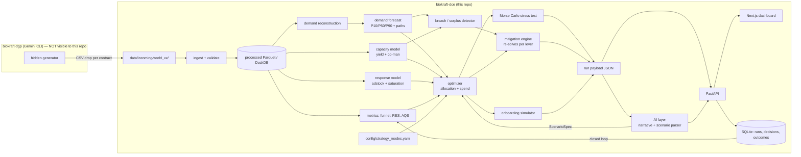

# ARCH — Biokraft Demand-Capacity Engine (DCE)

**Scope:** system design for the app repo `biokraft-dce`. The DGP (`biokraft-dgp`) is out of scope except for the **data contract** (§3), which is the only interface between the two.

---

## 1. System overview



**Key rule (IDEATION P1):** strategy config enters only at `OPT`, `RISK` thresholds, and `MIT` ranking. It never enters `FC`, `CAP`, `RESP`, or `MET`.

---

## 2. Tech stack

| Layer | Choice | Why |
|---|---|---|
| Language | Python 3.11+ (backend), TypeScript (frontend) | ecosystem for forecasting and optimization |
| Env / packaging | `uv` (Python), `pnpm` (frontend) | fast, lockfiles |
| Data | `polars` (primary), `pandas` where libraries need it; `pandera` for schema validation; Parquet + DuckDB | fast, typed, SQL over files |
| Forecasting | `statsforecast` (baselines, ETS, Theta), `lightgbm` (quantile global model) | quick, strong baselines + flexible ML |
| Response model | `scipy.optimize` (default); `pymc` optional (hierarchical, stretch) | simple first |
| Optimization | `pulp` modeling + **HiGHS** solver (`highspy`) | open-source LP/MILP, fast |
| API | FastAPI + pydantic v2 | typed contracts |
| App state | SQLite via SQLModel | simple, file-based |
| LLM | Anthropic SDK behind `LLMClient` interface | provider-agnostic |
| Frontend | Next.js (App Router), Tailwind, Recharts, TanStack Query | fast dashboard build |
| Tests | pytest, hypothesis (property tests), Playwright (optional e2e) | invariants matter |
| Packaging | Docker Compose (api + web) | one-command demo |

---

## 3. Data contract v1 (the only interface with the DGP)

Location in repo: `contract/` (JSON Schema + pandera models + `CONTRACT_VERSION`).

**Conventions**
- One folder per world: `data/incoming/<world_id>/` containing the files below plus `manifest.json` (contract version, date range, generation timestamp). The manifest must **not** describe the world's regime.
- Dates are ISO `YYYY-MM-DD`. Weeks start Monday. Currency INR. Quantities in **kg**.
- No ground-truth labels (no true demand, elasticity, event flags).
- Minimum history: 104 weeks.

### 3.1 `regions.csv`
| column | type | notes |
|---|---|---|
| region_id | str | PK |
| region_name | str | |
| tier | str | e.g. metro / tier1 / tier2 |
| cold_chain_available | bool | D2C deliverable if true |

### 3.2 `skus.csv` (product matrix, part 1)
| column | type | notes |
|---|---|---|
| sku_id | str | PK |
| product_line | str | e.g. cultivated_chicken, mycelium, seaweed, microbial |
| pack_size_kg | float | |
| status | enum | `rnd` / `pilot` / `production` / `retired` |
| expected_launch_date | date? | for rnd/pilot |
| shelf_life_days | int | |
| unit_cost_inr_per_kg | float | production cost |
| list_price_d2c_inr_per_kg | float | |

### 3.3 `product_matrix.csv` (product matrix, part 2)
| column | type | notes |
|---|---|---|
| sku_id | str | FK |
| channel | enum | `D2C` / `B2B` |
| region_id | str | FK |
| eligible_from | date | |
| eligible_to | date? | |

### 3.4 `orders.csv`
| column | type | notes |
|---|---|---|
| order_id | str | PK |
| order_date | date | when requested |
| channel | enum | `D2C` / `B2B` |
| region_id | str | FK |
| sku_id | str | FK |
| customer_id | str? | D2C only |
| account_id | str? | B2B only |
| requested_qty_kg | float | **unconstrained demand signal** |
| fulfilled_qty_kg | float | ≤ requested |
| unit_price_inr | float | |
| status | enum | `fulfilled` / `partial` / `waitlisted` / `cancelled_stockout` / `cancelled_other` |
| promised_date | date | |
| delivered_date | date? | |

### 3.5 `capacity_batches.csv` (in-house)
| column | type | notes |
|---|---|---|
| batch_id | str | PK |
| start_date | date | |
| end_date | date | |
| facility_id | str | |
| product_line | str | |
| planned_yield_kg | float | |
| actual_yield_kg | float | 0 if failed |
| outcome | enum | `success` / `partial` / `failed` |

### 3.6 `capacity_plan.csv` (forward-looking, known to the company)
| column | type | notes |
|---|---|---|
| week_start | date | covers history + ≥ 13 weeks ahead |
| facility_id | str | |
| product_line | str | |
| planned_batches | int | |
| planned_yield_per_batch_kg | float | |

### 3.7 `coman_contracts.csv`
| column | type | notes |
|---|---|---|
| coman_id | str | PK |
| product_line | str | |
| available_from | date | earliest possible |
| lead_time_weeks | int | activation → first output |
| min_commit_kg_per_week | float | once active |
| max_kg_per_week | float | |
| unit_cost_inr_per_kg | float | |
| min_active_weeks | int | |

### 3.8 `coman_activity.csv` (history of co-man use)
| column | type | notes |
|---|---|---|
| coman_id | str | FK |
| week_start | date | |
| requested_kg | float | |
| delivered_kg | float | reliability signal |

### 3.9 `b2b_accounts.csv`
| column | type | notes |
|---|---|---|
| account_id | str | PK |
| account_type | enum | `restaurant` / `qsr_chain` / `hotel` / `caterer` / `distributor` / `other` |
| region_id | str | primary region |
| regions_served | str | pipe-separated region_ids (reach) |
| outlets_count | int | reach |
| status | enum | `active` / `pipeline` / `churned` / `paused` |
| onboarded_date | date? | |
| contract_start | date? | |
| contract_end | date? | |
| committed_kg_per_month | float? | |
| contract_price_inr_per_kg | float? | |
| shortfall_penalty_inr_per_kg | float? | |
| requested_start_date | date? | pipeline only |
| requested_kg_per_month | float? | pipeline only |

### 3.10 `marketing_daily.csv`
| column | type | notes |
|---|---|---|
| date | date | |
| region_id | str | |
| channel | enum | usually `D2C`; `B2B` for trade marketing |
| campaign_type | enum | `ppc` / `native` / `social` / `influencer` / `email` / `trade` |
| campaign_id | str | |
| spend_inr | float | |
| impressions | int | |
| clicks | int | |
| unique_visitors | int | |
| bounces | int | |
| leads | int | |
| qualified_leads | int | |
| conversions | int | new customers |
| attributed_revenue_inr | float | platform-attributed (biased; don't trust blindly) |

### 3.11 `marketing_plan.csv` (forward-looking planned spend)
| column | type |
|---|---|
| week_start | date |
| region_id | str |
| channel | enum |
| campaign_type | enum |
| planned_spend_inr | float |

### 3.12 `customers.csv` (D2C CRM)
| column | type | notes |
|---|---|---|
| customer_id | str | PK |
| region_id | str | |
| acquired_date | date | |
| acquisition_campaign_type | enum? | null = organic / word of mouth |
| persona_segment | str | |
| churned_date | date? | inferred by company rules |
| is_subscriber | bool | |

### 3.13 `nps_responses.csv`
| column | type |
|---|---|
| response_date | date |
| channel | enum |
| region_id | str |
| customer_or_account_id | str |
| score | int 0–10 |

**Contract changes:** open a request in NOTES.md → bump `CONTRACT_VERSION` → the DGP side regenerates. Never adapt by inspecting DGP code.

---

## 4. Repository layout

```
biokraft-dce/
├── README.md
├── CLAUDE.md                     # short agent pointer to docs/ (optional)
├── docs/  IDEATION.md PRD.md ARCH.md TASK.md NOTES.md
├── contract/  CONTRACT_VERSION  schemas/*.json  models.py (pandera)
├── config/
│   ├── app.yaml                  # horizon, granularity, seeds, paths
│   ├── strategy_modes.yaml
│   ├── mitigations.yaml
│   └── scoring.yaml              # RES / AQS weights and thresholds
├── data/
│   ├── incoming/<world_id>/      # read-only DGP drops (gitignored)
│   ├── fixtures/                 # tiny hand-written test data (unit tests ONLY)
│   └── processed/                # Parquet (gitignored)
├── backend/
│   ├── pyproject.toml
│   └── dce/
│       ├── ingest/  metrics/  demand/  forecast/  capacity/  response/
│       ├── optimize/  risk/  mitigate/  onboarding/  ai/  eval/
│       ├── store/   api/   cli.py
│       └── tests/
├── frontend/                     # Next.js app
├── reports/                      # evaluation outputs (frozen before unblinding)
└── docker-compose.yml
```

---

## 5. Module design

Each module exposes pure functions over typed inputs. Side effects live only in `store/` and `api/`.

### 5.1 `ingest`
- `load_world(path) -> RawDataset`, then `validate(raw) -> ValidationReport` (pandera + referential checks + continuity checks).
- Writes Parquet to `data/processed/<dataset_hash>/`. `dataset_hash` = SHA-256 of sorted file hashes.
- **Guard:** refuses any path outside `data/incoming/` or `data/fixtures/`.

### 5.2 `demand` (reconstruction)
- Weekly unconstrained demand per (channel, region, sku[, account]) = Σ `requested_qty_kg`.
- Marks weeks with censoring (share of `waitlisted` + `cancelled_stockout` > 0).
- Sales = Σ `fulfilled_qty_kg` (kept for reporting only).
- If waitlist data is known to be incomplete, the censoring flag lets the forecaster treat those weeks as lower bounds (v2: Tobit-style correction).

### 5.3 `metrics`
- Funnel metrics per IDEATION §7.2, per (region, channel, week/month).
- LTV: cohort-based. Purchase frequency and AOV from orders; churn from `customers.csv`; margin from price − unit cost.
- **RES** (per region × channel):
  `RES = w_lift·z(sustained_lift) + w_econ·z(LTV:CAC) + w_ret·z(retention) + w_nps·z(NPS)`,
  then shrunk: `RES_shrunk = (n/(n+k))·RES + (k/(n+k))·mean(RES)`, where n = effective sample size and k comes from config.
  - *sustained_lift:* for each past spend step-up (> x% week-over-week, sustained ≥ 2 weeks), ratio of demand in weeks +5…+10 vs. the pre-period, relative to the lift in weeks +1…+4. Near 1 = sustained; near 0 = spike that died.
- **AQS** (per account): weighted z-scores of volume, stability (1 − CV of monthly orders vs. commitment), reach (outlets, regions served), margin, fill-history and reorder reliability, and penalty exposure, minus a concentration penalty. Pipeline accounts use account-type priors (`prior=true` flag).
- Weights and thresholds live in `config/scoring.yaml`, and every score returns its component breakdown.

### 5.4 `forecast`
**Series:**
- D2C: weekly demand per region (× SKU when > 1 production SKU).
- B2B active accounts: model *order-to-commitment ratio* per account (under/over-ordering behavior), then × commitment.
- B2B pipeline: not forecast as demand. Pipeline accounts enter only through the onboarding simulator or explicit scenarios.

**Models (per series, selected by backtest):**
1. `SeasonalNaive(52)` and `WindowAverage(8)` baselines (always computed).
2. `AutoETS`, `AutoTheta` (statsforecast).
3. `LightGBM` global quantile model across regions. Features: lags (1–4, 8, 13, 52), rolling mean/std, week-of-year, month, Indian holiday/festival calendar (public knowledge, allowed), region tier, **adstocked planned spend** (known-future covariate from `marketing_plan.csv`), price. **No feature may use information unavailable at forecast time.**

**Backtest:** rolling origin, ≥ 6 folds, horizon 13, step 4 weeks, within the training window only. Metrics: MASE (seasonality 52, fallback 1), pinball loss at 0.1/0.5/0.9, coverage.

**Selection:** lowest mean pinball loss. It must beat `SeasonalNaive` on MASE, otherwise use the baseline. Log the choice per series.

**Calibration:** split-conformal adjustment of P10/P90 from backtest residuals, per series or pooled by region tier.

**Anomalies:** robust z-score (median/MAD) on backtest residuals. Points with |z| > threshold are flagged `anomaly`, winsorized for training, and reported in the UI. No anomaly may be extrapolated.

**Output:** `ForecastSet` with quantiles plus `n_paths` sample paths per series (default 500), generated by sampling calibrated residuals with block bootstrap to preserve autocorrelation.

**Hierarchy:** v1 bottom-up aggregation to channel and total. v2: MinT reconciliation.

### 5.5 `capacity`
- **In-house:** per facility × product line, estimate per-batch yield ratio distribution (`actual/planned`, successes) and failure probability (Beta-Binomial posterior). Forward capacity per week = Σ over planned batches of `planned_yield × yield_ratio_sample × Bernoulli(1 − p_fail)`. Outputs quantiles plus paths aligned with the forecast paths.
- **Co-man:** deterministic once activated, available from `activation_week + lead_time_weeks`, bounded by `[min_commit, max]`. Reliability haircut = historical `delivered/requested` (quantile-sampled).
- **Perishability:** `shelf_life_days` determines carryover. If shelf life is under 7 days there is no carryover. Otherwise, inventory carries up to ⌊shelf_life/7⌋ weeks with a waste cost on expiry. v1 default: carryover ≤ 1 week, configurable.

### 5.6 `response` (spend → D2C demand)
Per region (pooled across campaign types in v1):

```
adstock_t   = spend_t + θ · adstock_{t-1}               θ ∈ [0, 0.9]
lift_t      = β · adstock_t^α / (κ^α + adstock_t^α)       Hill saturation
demand_t    = organic_t + lift_t + ε_t
```

- Fit θ, α, κ, β by constrained least squares on weekly data, with `organic_t` taken from a spend-free baseline (seasonal component). Report parameter uncertainty via bootstrap.
- **Extrapolation guard:** the recommended spend per region is capped at `max(observed weekly spend) × 1.5` (config).
- **Confounding guard:** fits with implausible elasticity (config bounds) or unstable bootstrap are marked `low_confidence`, and that region's spend is held at plan (no expansion) unless it's in the exploration budget.
- **Linearization for the optimizer:** the concave response curve is converted to K piecewise-linear segments with decreasing marginal lift. Since the objective is maximized, a concave curve stays a valid LP without binaries.

### 5.7 `optimize` (the core formulation)

**Indices:** months m ∈ M (horizon 3), weeks w ∈ W(m); regions r; accounts a ∈ A_active ∪ A_candidate (candidates only in the onboarding simulator); co-man partners j; response segments k.

**Parameters (from upstream modules and mode config):**
- `Cap_in[m]`: in-house capacity at mode quantile q_cap
- `D_org[r,m]`: D2C organic/baseline demand at mode quantile q_dem, where D2C forecast = organic + planned-spend lift
- `slope[r,k]`, `width[r,k]`: response segments (lift per ₹, segment width in ₹), lag-distributed across months
- `Commit[a,m]`: B2B commitment × forecast order-ratio quantile
- `p_d2c[r]`, `p_a`: prices; `c_in`, `c_j`: unit costs; `π_a`: shortfall penalty; `g_r`: D2C goodwill cost per unmet kg; `h`: waste cost
- `B[m]`: marketing budget; `ε`: exploration share; `RES[r]`, `τ_mode`: evidence gate
- `φ_mode`: B2B service floor; `s_max`: concentration cap

**Decision variables (all ≥ 0 unless noted):**
- `x[r,m]` D2C kg allocated · `y[a,m]` B2B kg allocated
- `u[r,m]` unmet D2C kg · `s[a,m]` B2B shortfall kg
- `sp[r,k,m]` spend in segment k (≤ `width[r,k]`)
- `v[j,m] ∈ {0,1}` co-man active · `q[j,m]` co-man kg
- `inv[m]` carryover · `waste[m]`

**Objective (weights λ from mode):**
```
max  Σ λ_rev·(p_d2c[r]·x[r,m] + p_a·y[a,m])
   − Σ λ_pen·π_a·s[a,m]
   − Σ λ_gw·g_r·u[r,m]
   − Σ c_j·q[j,m] − Σ h·waste[m]
   − Σ λ_spend·sp[r,k,m]
   + Σ λ_reach·reach_a·y[a,m]              (GROWTH)
   + Σ λ_cust·new_customers(sp)            (D2C_EXPANSION; linear in sp via CAC)
```

**Constraints:**
1. Capacity balance: `Σ_r x + Σ_a y + inv[m] + waste[m] = Cap_in[m] + Σ_j q[j,m] + inv[m−1]`
2. D2C demand: `x[r,m] + u[r,m] = D_org[r,m] + Σ_k slope[r,k]·lagged(sp[r,k,·])`
3. B2B: `y[a,m] + s[a,m] = Commit[a,m]`
4. Service floor: `y[a,m] ≥ φ_mode·Commit[a,m]` (soft: violation slack with a big penalty; reported)
5. Concentration: `y[a,m] ≤ s_max·(Cap_in[m] + Σ_j q[j,m])`
6. Budget: `Σ_{r,k} sp[r,k,m] ≤ B[m]`
7. Evidence gate: for r with `RES[r] < τ_mode`, spend above planned level is limited to `Σ_r extra_sp[r,m] ≤ ε·B[m]` (exploration pool)
8. Co-man: `q[j,m] ≤ max_j·v[j,m]`, `q[j,m] ≥ min_j·v[j,m]`, `v[j,m] = 0` before `available_from + lead_time` relative to the decision date, and min-active-weeks linking
9. Carryover: `inv[m] ≤ carry_limit`
10. Product-matrix eligibility: any `x`/`y` for an ineligible (sku, channel, region, period) is fixed to 0

**Solver:** HiGHS via PuLP; MILP only when co-man binaries are present. Time limit 10 s, MIP gap 0.5%. On infeasibility, relax the soft constraints and report which slacks are non-zero.

**Stress test (`optimize/stress.py`):** fix the plan (`x`, `y`, `sp`, co-man decisions). Sample N joint paths (demand paths × capacity paths, independent in v1). Simulate fulfillment with a priority rule (B2B floor first, then by solver shadow prices). Report expected revenue, margin, fill rates, P(any B2B shortfall), expected waste, and distributions.

**Baselines (`optimize/baselines.py`):** proportional-to-P50-demand, B2B-first, first-come-first-served. All run through the same stress test.

**Explanations:** every solve returns binding constraints, shadow prices (from the LP relaxation), and the top drivers for each allocation line.

### 5.8 `risk`
- Weekly `P_breach[w] = mean over paths( demand_path[w] > capacity_path[w] + committed_coman[w] )`.
- Breach week = first w with `P_breach[w] ≥ θ_mode`. Report expected shortfall `E[max(0, D − C)]`.
- Surplus week = first w with `P(capacity − demand > surplus_threshold) ≥ θ_surplus`.

### 5.9 `mitigate`
For each alert:
1. Load the catalog from `config/mitigations.yaml` (id, lever, lead_time_weeks, cost model, reversibility, harm score).
2. Feasibility: `lead_time_weeks ≤ weeks_until_breach`.
3. Impact: re-solve and stress-test with the lever enabled (e.g., co-man forced active from the earliest feasible week; waitlist = D2C goodwill cost lowered in affected regions; spend throttle = budget cap on starved regions).
4. Score = Δexpected_shortfall ÷ (Δcost + harm_weight·harm), with mode-specific weights.
5. Output ranked mitigations with `act_by_date = breach_week − lead_time`.

### 5.10 `onboarding`
Input: `Candidate{volume_kg_per_month, price, penalty, region, regions_served, outlets, account_type, earliest_start, max_start}` plus mode.
Enumerate start months × ramp profiles (`full`, `50→100`, `33→66→100`). For each, run solve + stress test with the candidate added as an active account. Compare with the no-onboard baseline. Output the best option by mode objective, the recommendation class (`accept_now` / `accept_from` / `phase` / `decline`), deltas, AQS (prior-based), and reasons.

### 5.11 `ai`
- `LLMClient` interface → `AnthropicClient` (model id from config/env).
- `explain(payload: RunPayload) -> Narrative`: the prompt contains **only** the payload JSON plus style rules. Output: headline, 3–6 bullet findings, and recommended actions.
- `NumberGroundingValidator`: extracts numeric tokens (including %, ₹, kg, dates) and matches them against the flattened payload (tolerance: rounding to displayed precision). On failure: one retry with the violations listed, then fallback to `templates/brief.md.j2`.
- `parse_scenario(text) -> ScenarioSpec`: structured output against a pydantic schema. Allowed levers: account volume change, new candidate account, capacity shock (% by weeks), co-man availability change, budget change, mode change, region spend freeze, SKU eligibility change. Anything else → `unsupported` with an explanation.
- Scenario execution copies the run inputs, applies the spec deterministically, re-solves, and diffs.
- The LLM never touches the database or the forecasting inputs.

### 5.12 `store`
SQLite tables: `datasets`, `runs(run_id, dataset_hash, config_hash, git_sha, mode, seed, created_at, status)`, `run_artifacts(run_id, kind, path)`, `recommendations`, `decisions(rec_id, action, reason, user, ts)`, `outcomes(rec_id, metric, predicted, realized)`, `scenarios`.
Large artifacts (forecast paths, etc.) go to Parquet under `data/processed/runs/<run_id>/`.

### 5.13 `eval`
- `split_world(dataset, holdout_weeks=13)`: the app sees only data before the cutoff. The holdout is loaded **only** by the evaluator.
- Scores forecasts (MASE, pinball, coverage), plans (realized revenue, fill rate, and waste when the plan is executed against held-out actual demand and capacity), and alerts (lead time, hit rate, false alarms).
- Writes `reports/eval_<timestamp>/` and marks it frozen (hash recorded in NOTES.md) before unblinding.

---

## 6. API (FastAPI, `/api/v1`)

| Method | Path | Purpose |
|---|---|---|
| POST | `/datasets/ingest` | `{world_path}` → dataset_hash + validation report |
| GET | `/datasets` · `/datasets/{hash}/health` | list; validation + backtest summary |
| POST | `/runs` | `{dataset_hash, mode, overrides?, seed?}` → run_id |
| GET | `/runs/{id}` | status + summary |
| GET | `/runs/{id}/forecast` · `/capacity` · `/allocation` · `/alerts` · `/stress` · `/narrative` | components |
| POST | `/runs/compare` | `{dataset_hash, modes[]}` → side-by-side |
| POST | `/runs/{id}/scenarios` | `{text}` or `{spec}` → scenario result + diff |
| POST | `/onboarding/simulate` | `{dataset_hash, candidate, mode}` |
| GET | `/metrics/funnel` | `?dataset&region&channel&grain` |
| GET | `/metrics/scores` | RES + AQS with components |
| GET/POST | `/decisions` | log accept/reject with reason |
| GET | `/eval/{dataset_hash}` | evaluation results (only if run by the evaluator) |

All responses carry `run_id` / `dataset_hash` for traceability.

---

## 7. Configuration

### `config/strategy_modes.yaml` (initial values; tune in NOTES with rationale)
```yaml
GROWTH:
  q_capacity: 0.5
  q_demand_b2b: 0.5
  weights: {rev: 1.0, pen: 1.0, gw: 0.3, spend: 1.0, reach: 0.2, cust: 0.0}
  b2b_service_floor: 0.85
  res_gate: 0.0          # z-score threshold
  exploration_share: 0.10
  breach_threshold: 0.30
  onboarding_aqs_weights: reach_heavy
STABILITY:
  q_capacity: 0.15
  q_demand_b2b: 0.8
  weights: {rev: 1.0, pen: 3.0, gw: 0.6, spend: 1.0, reach: 0.0, cust: 0.0}
  b2b_service_floor: 0.98
  res_gate: 0.5
  exploration_share: 0.0
  breach_threshold: 0.15
  onboarding_aqs_weights: reliability_heavy
D2C_EXPANSION:
  q_capacity: 0.5
  q_demand_b2b: 0.5
  weights: {rev: 1.0, pen: 1.5, gw: 0.2, spend: 1.0, reach: 0.0, cust: 0.5}
  b2b_service_floor: 0.90
  res_gate: 0.3
  exploration_share: 0.15
  breach_threshold: 0.30
  onboarding_policy: paused_unless_exceptional
```

`config/mitigations.yaml` holds lead times, cost models, and harm scores for M1–M6. `config/scoring.yaml` holds RES/AQS weights, shrinkage k, and anomaly threshold.

---

## 8. Cross-cutting concerns

- **Determinism:** global seed in `app.yaml`. Each module derives sub-seeds from `(seed, module, series_id)`.
- **Logging:** structlog JSON logs with `run_id`. Every module logs inputs hash, outputs hash, and duration.
- **Errors:** typed exceptions (`ContractViolation`, `InfeasiblePlan`, `UngroundedNarrative`, …) mapped to API error codes.
- **Performance:** forecast series run in parallel (joblib). Stress test is vectorized with numpy.
- **Security:** API key from env only. No outbound calls except to the LLM provider.

---

## 9. Required invariant tests

1. Allocated kg ≤ available capacity (every month, every path in the stress test).
2. `x[r,m] ≤` D2C demand; `y[a,m] ≤ Commit[a,m]`.
3. Floors hold when feasible; when not feasible, the slack is reported.
4. **Mode invariance:** the forecast artifact hash is identical across all modes for the same data + seed.
5. Ingest refuses paths outside `data/incoming/` and `data/fixtures/`.
6. No evaluator holdout data is readable by the run pipeline (the split is enforced in the loader).
7. Narrative validator rejects any number absent from the payload.
8. Onboarding with a zero-volume candidate equals the baseline plan.
9. Increasing capacity never lowers the optimal objective (monotonicity property test).
